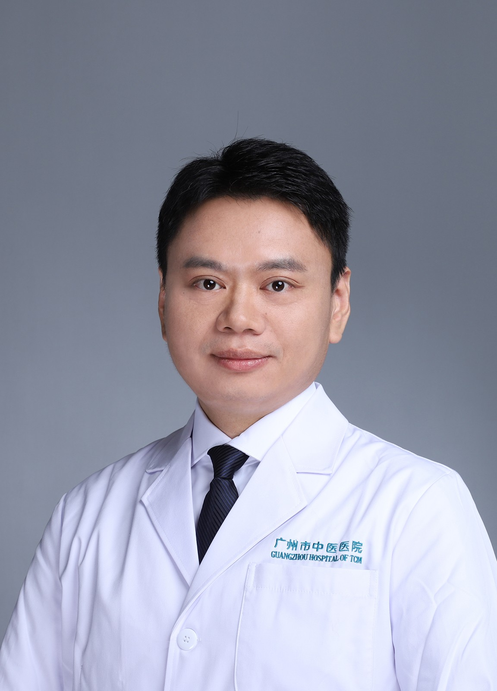

<!-- AUTO-GENERATED-BY: work/generate_obsidian_profiles.py -->

<!-- TEMPLATE: D:\workspace\信息收集整理\医生画像仓库\模板\医生画像模板.md -->

# 鲁义

## 基础信息

| 字段 | 内容 |
|---|---|
| 姓名 | 鲁义 |
| 医院 | 广州市中医院 |
| 科室 | 麻醉科 |
| 职称/身份 | 主任医师 |
| 来源链接 | [官网原文](https://www.gzszyy.com/expert/2026/ELe36rd6.html) |
| 采集日期 | 2026-08-13 |

## 简介/擅长

疑难危重病人的精准麻醉及癌性疼痛的治疗。

## 可包装亮点

- 广州医科大学附属中医医院天河院区 麻醉科 负责人，主任医师， 医学博士，硕士研究生导师 青年学术委员会副主任委员；
- 青年重点人才。
- 长期从事中西医结合治疗神经痛的临床诊疗及基础研究工作，擅长疑难危重病人的精准麻醉及癌性疼痛的治疗。
- 任广东省中西医结合学会麻醉学专业委员会副主任委员、广东省医学会麻醉治疗学分会常务委员、广州市医学会疼痛学分会常务委员。

## 重点疾病/人群标签

- 慢性病：
- 肿瘤：癌、疼痛、疑难、危重
- 生殖疾病：
- 免疫/风湿：
- 术后恢复/康复：癌、疼痛、疑难、危重
- 疑难重症：癌、疼痛、疑难、危重

## 证据摘录

> 只摘录官网公开信息中的短句或关键字段，不复制大段原文。

- 官网身份字段：主任医师
- 官网简介/擅长：疑难危重病人的精准麻醉及癌性疼痛的治疗。
- 官网亮眼经历线索：广州医科大学附属中医医院天河院区 麻醉科 负责人，主任医师， 医学博士，硕士研究生导师 青年学术委员会副主任委员； 青年重点人才。 长期从事中西医结合治疗神经痛的临床诊疗及基础研究工作，擅长疑难危重病人的精准麻醉及癌性疼痛的治疗。 任广东省中西医结合学会麻醉学专业委员会副主任委员、广东省医学会麻醉治疗学分会常务委员、广州市医学会疼痛学分会常务委员。
- 来源链接：https://www.gzszyy.com/expert/2026/ELe36rd6.html

## BD 画像摘要

鲁义医生可作为肿瘤、术后恢复/康复、疑难重症方向的基础画像候选。后续 BD 使用应继续以官网来源和人工复核为准，不添加疗效承诺或无来源包装。

## 合规边界

- 仅使用医院官网、官方公众号、官方小程序等公开渠道。
- 不采集私人电话、私人微信、家庭住址、患者隐私或非公开排班信息。
- 不写“保证治愈”“疗效第一”“包治疑难杂症”等无法由官网证明的表述。
