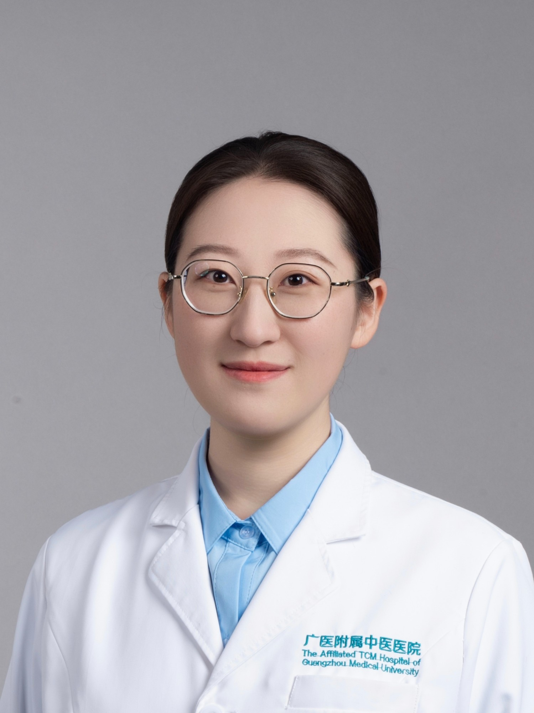

<!-- AUTO-GENERATED-BY: work/generate_obsidian_profiles.py -->

<!-- TEMPLATE: D:\workspace\信息收集整理\医生画像仓库\模板\医生画像模板.md -->

# 黄婧妍

## 基础信息

| 字段 | 内容 |
|---|---|
| 姓名 | 黄婧妍 |
| 医院 | 广州市中医院 |
| 科室 | 心病科（心血管内科） |
| 职称/身份 | 中医师 |
| 来源链接 | [官网原文](https://www.gzszyy.com/expert/2026/xkazq5eJ.html) |
| 采集日期 | 2026-08-13 |

## 简介/擅长

中西医结合防治冠心病、心力衰竭、高血压、心律失常等心血管内科常见疾病，熟悉冠脉介入治疗及心血管相关重症监护

## 教育与进修经历

- 中医师，医学博士 毕业于广州中医药大学，师从美国心律学会院士、中国大湾区心脏协会执行主席陈秋雄教授。

## 科研项目与成果

- 先后参与国家级课题、省级课题4项，国家一级学会团体标准1项。

## 可包装亮点

- 中医师，医学博士 毕业于广州中医药大学，师从美国心律学会院士、中国大湾区心脏协会执行主席陈秋雄教授。
- 先后参与国家级课题、省级课题4项，国家一级学会团体标准1项。

## 重点疾病/人群标签

- 慢性病：高血压、冠心病、心力衰竭、重症
- 肿瘤：
- 生殖疾病：
- 免疫/风湿：
- 术后恢复/康复：
- 疑难重症：高血压、冠心病、心力衰竭、重症

## 证据摘录

> 只摘录官网公开信息中的短句或关键字段，不复制大段原文。

- 官网身份字段：中医师
- 官网简介/擅长：中西医结合防治冠心病、心力衰竭、高血压、心律失常等心血管内科常见疾病，熟悉冠脉介入治疗及心血管相关重症监护
- 官网亮眼经历线索：中医师，医学博士 毕业于广州中医药大学，师从美国心律学会院士、中国大湾区心脏协会执行主席陈秋雄教授。 先后参与国家级课题、省级课题4项，国家一级学会团体标准1项。
- 来源链接：https://www.gzszyy.com/expert/2026/xkazq5eJ.html

## BD 画像摘要

黄婧妍医生可作为慢性病、疑难重症方向的基础画像候选。后续 BD 使用应继续以官网来源和人工复核为准，不添加疗效承诺或无来源包装。

## 合规边界

- 仅使用医院官网、官方公众号、官方小程序等公开渠道。
- 不采集私人电话、私人微信、家庭住址、患者隐私或非公开排班信息。
- 不写“保证治愈”“疗效第一”“包治疑难杂症”等无法由官网证明的表述。
