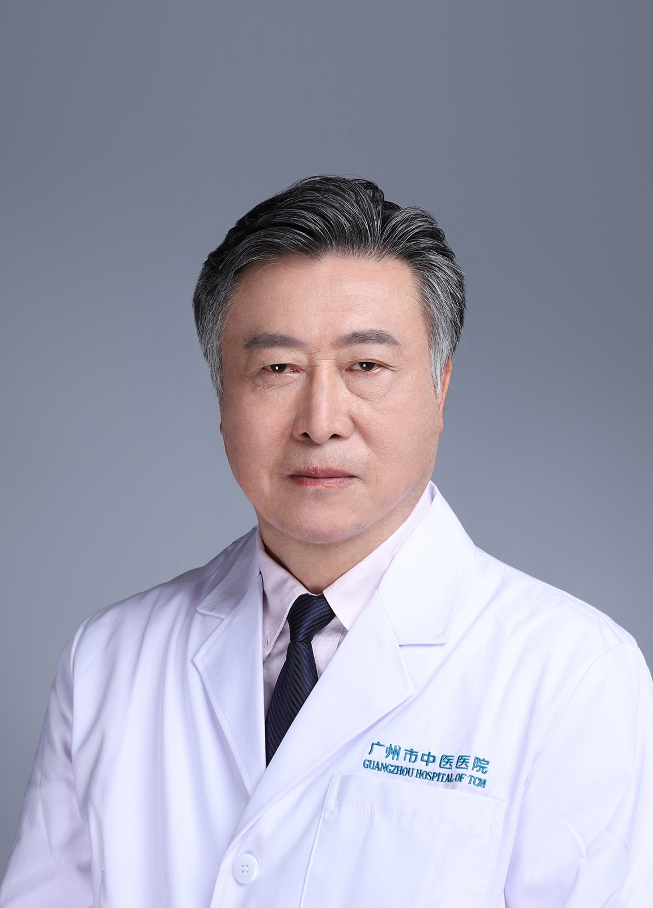

<!-- AUTO-GENERATED-BY: work/generate_obsidian_profiles.py -->

<!-- TEMPLATE: D:\workspace\信息收集整理\医生画像仓库\模板\医生画像模板.md -->

# 龙云

## 基础信息

| 字段 | 内容 |
|---|---|
| 姓名 | 龙云 |
| 医院 | 广州市中医院 |
| 科室 | 外科 |
| 职称/身份 | 主任医师 |
| 来源链接 | [官网原文](https://www.gzszyy.com/expert/2026/BDbD0Ybl.html) |
| 采集日期 | 2026-08-13 |

## 简介/擅长

外科疾病的诊断手术和微创手术的治疗：1.泌尿外科系统的肾、输尿管、膀胱前列腺、尿道和生殖系统常见疾病、结石、肿瘤的诊断治疗和手术以及微创腔镜手术。2.普通外科的甲状腺、乳腺、胃、肠、肝、胆脏器常见疾病和肿瘤疾病诊断治疗和常规手术以及腹腔镜微创手术的治疗。特别是手术后的中、西结合的综合治疗促进愈合、康复和肿瘤预防复发的长期跟进治疗。

## 教育与进修经历

- 毕业于广州医科大学，大 外科 临床工作43年，长期从事大 外科 一线的危、急疑难和重大外伤的诊断、抢救、手术的工作，尤其擅长：1.泌尿 外科 系统的肾、输尿管、膀胱、前列腺、尿道和生殖系统常见疾病、结石、肿瘤的诊断、手术和微创腔镜手术的治疗。

## 可包装亮点

- 原广东省中西医结合泌尿 外科 学会常委、广东省中医 外科 学会常委、广东省中西医结合学会男科学常委、中华医学会广州市泌尿 外科 学会常委、中华医学会广州市微创泌尿 外科 学会常委、中华医学会广州市腹腔镜 外科 学会常委。
- 毕业于广州医科大学，大 外科 临床工作43年，长期从事大 外科 一线的危、急疑难和重大外伤的诊断、抢救、手术的工作，尤其擅长：1.泌尿 外科 系统的肾、输尿管、膀胱、前列腺、尿道和生殖系统常见疾病、结石、肿瘤的诊断、手术和微创腔镜手术的治疗。

## 重点疾病/人群标签

- 慢性病：
- 肿瘤：肿瘤、乳腺癌、生殖、不孕、术后、康复、疑难
- 生殖疾病：肿瘤、乳腺癌、生殖、不孕、术后、康复、疑难
- 免疫/风湿：
- 术后恢复/康复：肿瘤、乳腺癌、生殖、不孕、术后、康复、疑难
- 疑难重症：肿瘤、乳腺癌、生殖、不孕、术后、康复、疑难

## 证据摘录

> 只摘录官网公开信息中的短句或关键字段，不复制大段原文。

- 官网身份字段：主任医师
- 官网简介/擅长：外科疾病的诊断手术和微创手术的治疗：1.泌尿外科系统的肾、输尿管、膀胱前列腺、尿道和生殖系统常见疾病、结石、肿瘤的诊断治疗和手术以及微创腔镜手术。2.普通外科的甲状腺、乳腺、胃、肠、肝、胆脏器常见疾病和肿瘤疾病诊断治疗和常规手术以及腹腔镜微创手术的治疗。特别是手术后的中、西结合的综合治疗促进愈合、康复和肿瘤预防复发的长期跟进治疗。
- 官网亮眼经历线索：原广东省中西医结合泌尿 外科 学会常委、广东省中医 外科 学会常委、广东省中西医结合学会男科学常委、中华医学会广州市泌尿 外科 学会常委、中华医学会广州市微创泌尿 外科 学会常委、中华医学会广州市腹腔镜 外科 学会常委。 毕业于广州医科大学，大 外科 临床工作43年，长期从事大 外科 一线的危、急疑难和重大外伤的诊断、抢救、手术的工作，尤其擅长：1.泌尿 外科 系统的肾、输尿管、膀胱、前列腺、尿道和生殖系统常见疾病、结石、肿瘤的诊断…
- 来源链接：https://www.gzszyy.com/expert/2026/BDbD0Ybl.html

## BD 画像摘要

龙云医生可作为肿瘤、生殖疾病、术后恢复/康复、疑难重症方向的基础画像候选。后续 BD 使用应继续以官网来源和人工复核为准，不添加疗效承诺或无来源包装。

## 合规边界

- 仅使用医院官网、官方公众号、官方小程序等公开渠道。
- 不采集私人电话、私人微信、家庭住址、患者隐私或非公开排班信息。
- 不写“保证治愈”“疗效第一”“包治疑难杂症”等无法由官网证明的表述。
